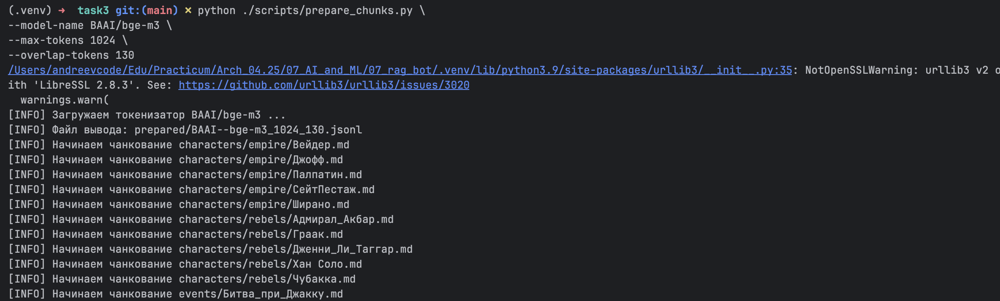

# Задание 3. Создание векторного индекса базы знаний
> Теперь вам нужно преобразовать подготовленную базу знаний в векторный индекс. Он потребуется, чтобы искать релевантные фрагменты текста по пользовательским запросам.
## Что нужно сделать?
>1. Выберите эмбеддинг-модель. Используйте ту, что вы уже выбрали в Задании 1 (например, all-MiniLM-L6-v2, text-embedding-ada-002, bge-base-en и другие).
>Желательно указать:
>   - Название модели
>   - Ссылку на репозиторий / API
>   - Размер эмбеддингов
>2. Преобразуйте тексты в чанки.
>   - Разбейте текстовые документы на логически связанные чанки (по 100–300 слов или по 500–1000 токенов).
>   - При этом вам нужно сохранить оригинальный источник и позицию, чтобы впоследствии бот смог опираться на них для цитирования и объяснений.
>   - Используйте готовые функции (например, RecursiveCharacterTextSplitter в LangChain).
>3. Сгенерируйте эмбеддинги
>   - Получите векторное представление каждого чанка с помощью выбранной модели.
>   - Сохраняйте сопутствующие метаданные: путь к файлу, заголовок, id чанка и т. д.
>4. Создайте индекс в векторной БД
>   - Используйте FAISS / Chroma / Qdrant (в зависимости от решения Задания 1).
>   - Загрузите эмбеддинги в индекс.
>   - Обеспечьте возможность дальнейшего поиска по запросу.

## Решение

### 1. Зависимости
Установка зависимостей:
```shell
    pip install -r requirements.txt sentence-transformers chromadb 
``` 
Будет установлено:
- `sentence-transformers` в `.venv` для работы с моделями эмбеддингов из HuggingFace Hub:
  - загрузка по строковому имени;
  - удобный интерфейс для настройки и инференса; пример ниже:
    ```python
        from sentence_transformers import SentenceTransformer

        model = SentenceTransformer("BAAI/bge-m3")
        embeddings = model.encode(["hello world"])
    ``` 
- `chromadb` — клиент ChromaDB (выбрана в Задании 1), нужен для записи эмбеддингов в индекс.
### 2. Выбор модели
Выбранная модель: [BAAI--bge-m3](https://huggingface.co/BAAI/bge-m3).
Построены два индекса (512–60 и 1024–130). Базовым считается вариант 1024 токена с перекрытием 130.

Временные характеристики для базового варианта:
- Чанкование: 1.22 сек:
  
  
- Построение индекса: 15.25 сек:
  

### 3. Сбор метаданных и чанкование
Скрипт [task3/scripts/prepare_chunks.py](scripts/prepare_chunks.py) режет документы базы знаний на чанки.

Используется токенизатор выбранной модели. Чанки и метаданные сохраняются в `.jsonl` в каталоге [task3/prepared](prepared). Имя файла отражает модель и параметры (`max-tokens`, `overlap-tokens`).

#### Краткое описание скрипта
- загружает `AutoTokenizer` для модели, указанной через `--model-name BAAI/bge-m3`;
- позволяет менять параметры, например: `--max-tokens 256 --overlap-tokens 64`;
- режет документы из [task2/knowledge_base](../task2/knowledge_base) по токенам и структуре Markdown (цепочка `MarkdownHeaderTextSplitter` → `RecursiveCharacterTextSplitter`);
- по умолчанию перекрытие `overlap-tokens` ≈ 10% от `max-tokens`; если раздел меньше `max-tokens`, overlap фактически не применяется;
- собирает метаданные для каждого чанка:
  - `section_path` — путь по заголовкам, например `["Матч при Ролланд Гаррос", "Предшествовавшие события", "Подготовка"]`;
  - `doc_id` — внутренний ID документа;
  - `rel_doc_id` — относительный путь файла (например, `characters/empire/Вейдер.md`); в LLM не передаётся, но полезен для фильтров;
  - статистика по токенам, например `"n_tokens": 985, "overlap_tokens": 0, "start_token": 0, "end_token": 985`.

#### Запуск скрипта
```shell
python ./scripts/prepare_chunks.py \
--model-name BAAI/bge-m3 \
--max-tokens 1024 \
--overlap-tokens 130
```
Дефолтные значения параметров:
- `--docs-path=../task2/knowledge_base`;
- `--out-dir=./prepared`;
- `--model-name=BAAI/bge-m3`;
- `--max-tokens=256`;
- `--overlap-tokens=64`.

### 4. Построение эмбеддингов с сохранением в БД
Используется скрипт [task3/scripts/build_index.py](scripts/build_index.py), который работает с заданным файлом чанков:
- определяет модель эмбеддингов по имени файла (slug → имя модели HF);
- через `SentenceTransformer` строит вектор для каждого чанка;
- записывает в `chroma_db`, создавая коллекцию и индекс в [task3/chroma_db](.local_chroma_db_v0) (по умолчанию);
- метаданные коллекции можно посмотреть в [task3/chroma_db/chroma.sqlite3](.local_chroma_db_v0/chroma.sqlite3);
- допускается хранить несколько коллекций в одной БД для сравнения моделей и параметров чанкования.
```python
    collection = client.create_collection(
        name=collection_name,
        metadata={
            "embedding_model": model_name,
            "model_slug": model_slug,
            "max_chunk_tokens": max_tokens,
            "chunk_overlap_tokens": overlap,
        },
    )
    
    print("[INFO] Записываем документы в коллекцию ...")
    collection.add(
        ids=chunk_ids,
        documents=texts,
        metadatas=metadatas,
        embeddings=embeddings.tolist(),
    )
```
#### Запуск скрипта
```shell 
python ./scripts/build_index.py --chunks-path ./prepared/BAAI--bge-m3_1024_130.jsonl 
```
Дефолтные значения параметров: `--chroma-dir=./chroma_db`;

### 5. Тесты поиска по индексу
После создания индекса тесты запускаются скриптом [task3/scripts/search_tests.py](scripts/search_tests.py) для нужной коллекции.

Скрипт прогоняет набор хороших и плохих запросов: строит эмбеддинги, ищет в `chroma_db`, выводит top‑чанки и дистанции.
```python
    # 3.2. Запрос к Chroma
    query_embedding = model.encode(
        [test["query"]],
        normalize_embeddings=True,
    ).tolist()

    result = collection.query(
        query_embeddings=query_embedding,
        n_results=top_k,
        include=["metadatas", "documents", "distances"],
    )

    metadatas = result.get("metadatas", [[]])[0]
    documents = result.get("documents", [[]])[0]
    distances = result.get("distances", [[]])[0]
    ids = result.get("ids", [[]])[0]
```

Для проверки используются метаданные top‑чанков:
- для хороших запросов ожидаемый документ должен найтись;
- для плохих — ожидаемый документ не должен попасть в выдачу.

#### Запуск скрипта
```shell
python ./scripts/search_tests.py --collection-name BAAI--bge-m3_1024_132
```
Дефолтные значения параметров:
- `--chroma-path=./chroma_db`;
- `--top-k=4`;


#### Выводы по тестам для  `BAAI--bge-m3`
- сравнение 512–60 (вариант 1) vs 1024–130 (вариант 2):
    - оба индекса проходят тесты;
    - по средней дистанции top‑результатов чуть лучше вариант 2, но не всегда;
    - иногда результаты одинаковые, иногда чуть лучше вариант 1;
- чтобы увидеть устойчивую разницу, нужно больше тестовых запросов;
- большие чанки теоретически дают более релевантные ответы для детализированных вопросов;
- но при жёстком лимите контекста для LLM слишком крупные чанки мешают захватить разнообразные фрагменты по общим вопросам.


**Пример вывода тестов:**


### 6. Удаление коллекции с индексом из Chroma
Коллекцию можно удалить через `chroma_db API` тем же способом, что и создавать — скриптом [task3/scripts/delete_index.py](scripts/delete_index.py).
Важно: каталоги с индексом при этом не удаляются.
```shell
python ./scripts/delete_index.py --collection-name BAAI--bge-m3_1024_132
```
Дефолтные значения параметров:`--chroma-path=./chroma_db`.

### 7. Альтернативы и тюнинг чанкования и создания эмбеддингов
1. Чанкование по токенам, а не по символам (уже применяется) — снижает риск несовпадений с моделью эмбеддингов.
2. Чанкование с учётом структуры Markdown (уже применяется) — повышает релевантность поиска.
3. Проверять соответствие имени файла и содержимого перед добавлением имени в метаданные.
4. Собирать в метаданные списки персонажей/терминов из чанка — пригодится для фильтров после поиска.
5. Подбирать размер чанка и перекрытие по практическим критериям.
6. Учитывать тип запросов и лимиты контекста для LLM:
    - общие запросы по множеству документов → уменьшать размер чанка;
    - детализированные запросы по одному документу → увеличивать размер чанка.
7. Подбирать top‑N на поиске и добавлять фильтрации перед LLM, чтобы улучшать качество и укладываться в лимиты.
8. Для индекса в chroma_db лучше использовать `cosine` (по умолчанию L2). В этом случае нужна нормализация и при индексации, и при построении эмбеддинга запроса:
    ```python
   
        # 3.2.1 Поиск эмбеддинга запроса (важно с нормализацией, т.к. cosine)
        query_embedding = embedder.encode(
            test["query"],
            normalize_embeddings=True,
        ).tolist()
    ```
8. На будущее — рассмотреть rerank как способ улучшить контекст до отправки в LLM:
   - в текущем задании не пригодилось после правок чанкования;
   - возможный код:
      ```python
      model_name = get_model_name_for_collection(client, collection_name)
      embedder = SentenceTransformer(model_name)  # model_name взяли из metadata
      reranker = CrossEncoder(model_name)
     
      ...
      result = collection.query(
          query_embeddings=query_embedding,
          n_results=40,
          include=["metadatas", "documents", "distances"],
      )

      metadatas = result.get("metadatas", [[]])[0]
      documents = result.get("documents", [[]])[0]
      distances = result.get("distances", [[]])[0]
      ids = result.get("ids", [[]])[0]

      # 2) rerank
      # K кандидатов уже получены из Chroma: documents, metadatas, distances

      alpha = 0.4  # 0.1..0.4 обычно разумный диапазон

      # 1) Готовим пары (query, header) для reranker
      headers = [str(m.get("section_path", "")) for m in metadatas]
      pairs = [(test["query"], h) for h in headers]

      # 2) Cross-encoder rerank по заголовкам (score: больше = лучше)
      rerank_scores = reranker.predict(pairs)

      # 3) Смешиваем dense + rerank
      items = []
      for doc, meta, dist, rscore in zip(documents, metadatas, distances, rerank_scores):
          dense_score = -float(dist)                  # меньше dist = лучше => делаем больше=лучше
          final_score = dense_score + alpha * float(rscore)

          items.append((final_score, dense_score, float(rscore), doc, meta, float(dist)))

      # 4) Сортируем по финальному скору
      items.sort(key=lambda x: x[0], reverse=True)

      topN = items[:top_k]
      ```
