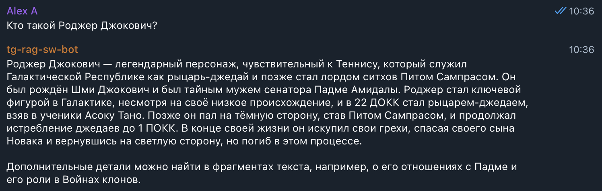
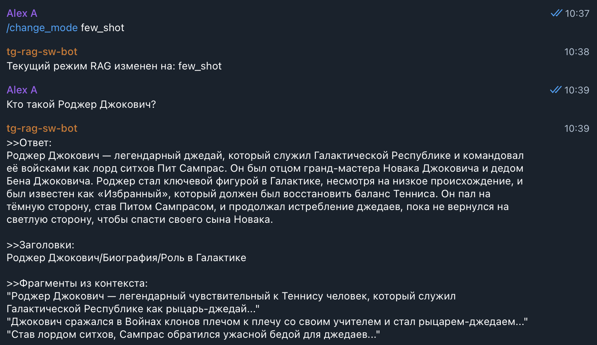
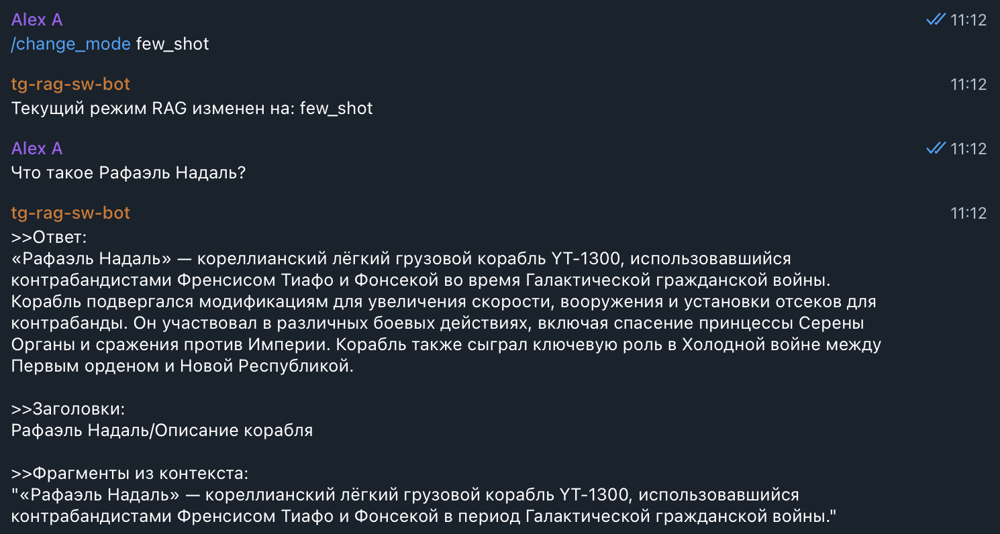
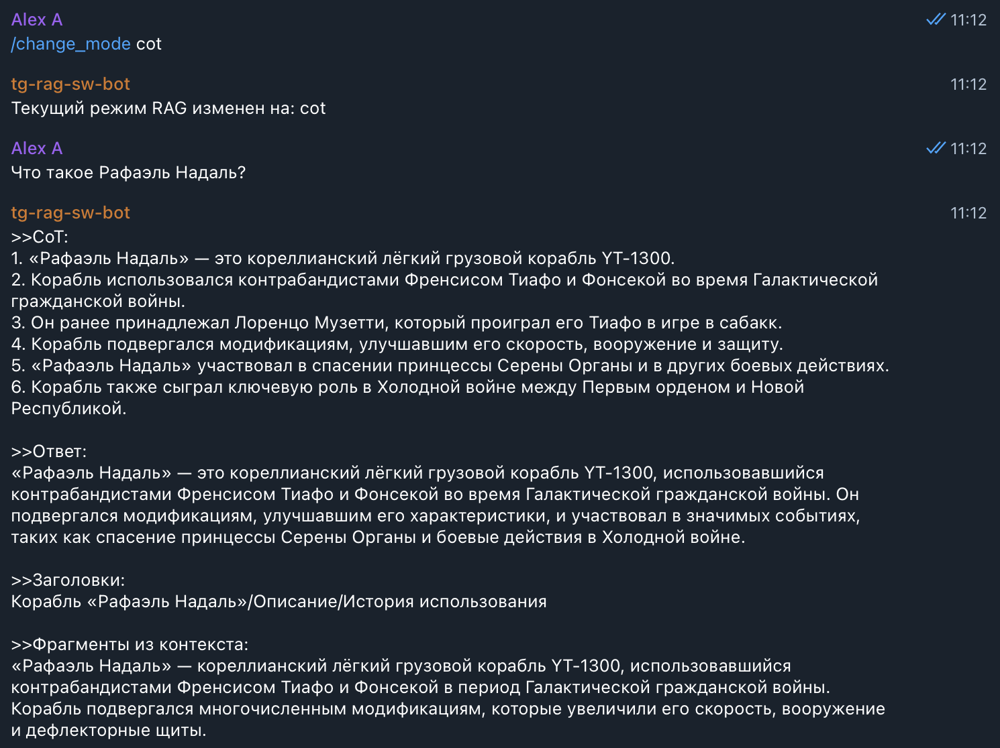
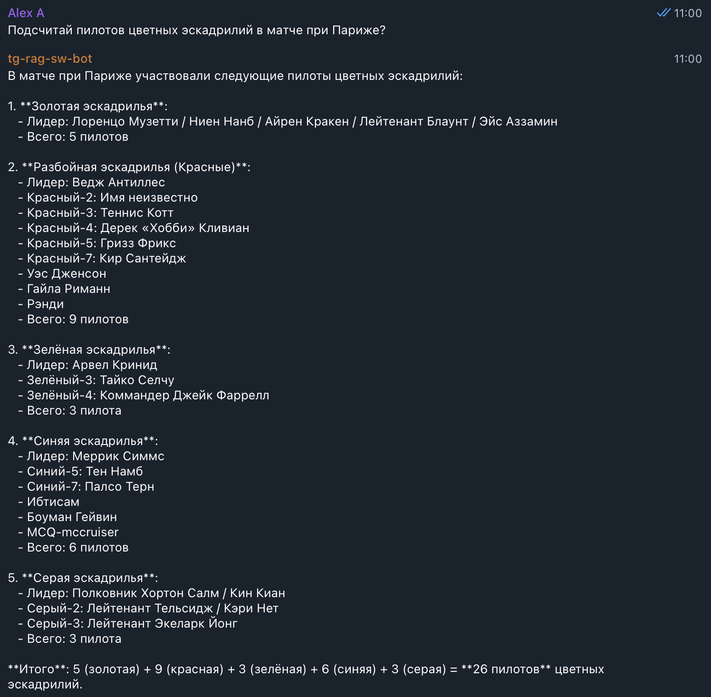
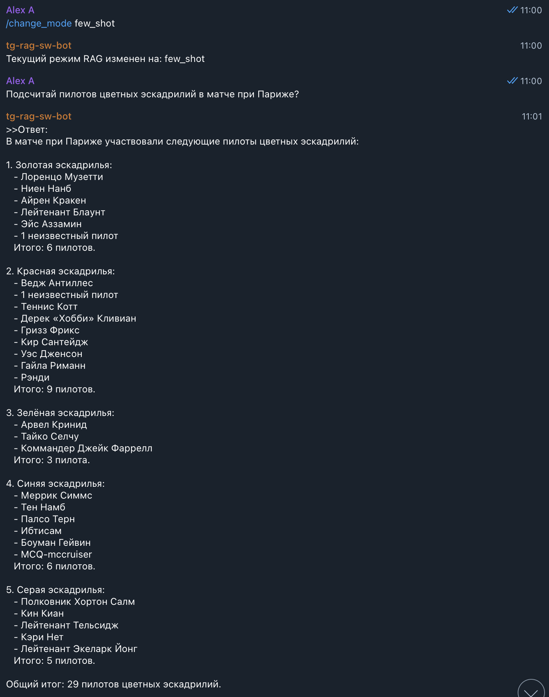
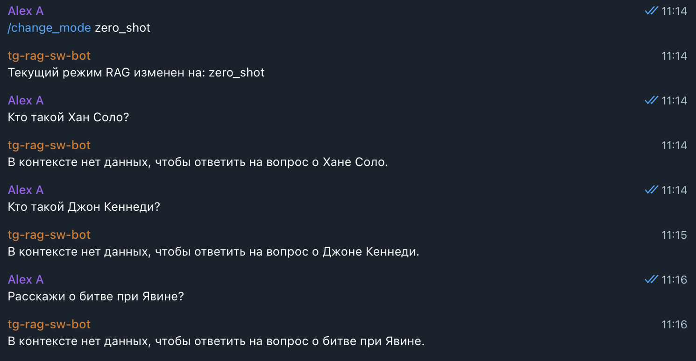
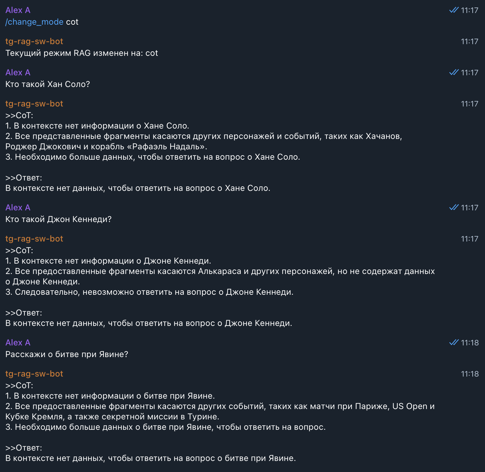

# Задание 4. Реализация RAG-бота с техниками промптинга
> Создайте работающего RAG-бота, который будет уметь:
> - искать информацию в вашей векторной базе знаний;
> - формировать ответы с опорой на найденные данные;
> - применять техники улучшения качества ответа: Few-shot и Chain-of-Thought.

> Такой бот станет той основой, на которой в будущем можно построить корпоративного ассистента, справочную систему или помощника техподдержки.

## Что нужно сделать?
> 1. Настройте пайплайн RAG. Создайте скрипт или модуль на Python, который способен:
>    - получать текстовый запрос пользователя,
>    - преобразовать его в эмбеддинг (тем же энкодером, что и при построении индекса),
>    - искать ближайшие чанки в векторной базе (Faiss, Chroma и другие),
>    - формировать промпт с найденными фрагментами,
>    - отправлять его в LLM (OpenAI, YandexGPT, локальная модель),
>    - возвращать пользователю результат.
>    Подсказка: если используете LangChain, то возьмите готовую цепочку RetrievalQA, но нужно понимать, что происходит под капотом.
> 
> 2. Подключите технику Few-shot prompting
>    - Добавьте в промпт 1-2 заранее заданных примера:
>    ```md
>      Q: Как называется столица планеты Ти’лора?  
>      A: Столица планеты Ти’лора называется Сайрон.
>    
>      \
>      Q: [запрос пользователя]
>      A: ...
>     ```
>    - Примеры должны быть из той же предметной области, что и ваша база. Лучше, если они реально извлекаются из базы, а не просто придумываются «из головы».
> 
> 3. Подключите Chain-of-Thought (CoT)
>    - В System-промпт добавьте указание, чтобы модель объясняла свои шаги:
>    System: Ты помощник, который сначала размышляет, а потом отвечает. Всегда пиши свои шаги.  
>    - Пример желаемого поведения:
>     ```md
>      1. Сначала найду, какая технология используется в HyperRelay.
>      2. В документе указано, что HyperRelay питается от ядра VoidCore.
>      3. Следовательно, ответ — VoidCore.
>     ```
> 4. Постройте интерфейс. Выберите один из вариантов:
>    - простой REPL (консольный бот),
>    - REST API (например, через FastAPI),
>    - Telegram-бот (если уверены в себе).
>    - Важно! Интерфейс вторичен. Главное — правильно реализованная цепочка RAG.
>    
> 5. Результат. По итогу задания у вас должно получиться:
>    - репозиторий с модулем RAG:
>    - загрузка индекса;
>    - приём запроса;
>    - поиск;
>    - промптинг (few-shot, CoT);
>    - генерация ответа;
>    - запускаемый скрипт или endpoint;
>    - примеры 3–5 успешных диалогов;
>    - примеры одного-двух случаев, когда бот будет отвечать: «Я не знаю».

## ADR: общие решения
1. В качестве LLM выбрана внешняя модель OpenAI `gpt-4o-mini`:
   - простая интеграция;
   - устойчивое качество на русском;
   - проще и быстрее, чем развёртывать крупные локальные модели;
   - приемлемая скорость и стоимость API.
2. Запуск через `docker-compose` для двух приложений: [rag-api](rag-api) и [tg-rag-sw-bot](tg-rag-sw-bot).
3. Приложение [rag-api](rag-api) объединяет:
   - клиент `ChromaDb` (инициализация при старте);
   - клиент `OPENAI_API` (инициализация при старте);
   - клиент эмбеддера `BAAI/bge-m3` (инициализация при старте);
   - бизнес-логику RAG;
   - Flask API с эндпойнтами:
     - основные:
       - `POST /api/rag/query`: запрос пользователя → ответ LLM;
       - `GET /api/rag/mode`: текущий режим (zero_shot, few_shot, cot);
       - `POST /api/rag/mode`: переключение режима;
     - на будущее (реализовано, но вне скоупа полноценных тестов):
       - `GET /api/rag/prompt?mode`: текст инструкции для режима `mode` (или текущий);
       - `PUT /api/rag/prompt?mode`: правка инструкции для режима `mode`.
4. Телеграм-бот [tg-rag-sw-bot](tg-rag-sw-bot) — интерфейс к `rag-api`:
   - базовый сценарий:
     - `POST /api/rag/query`: проксирует запрос в RAG;
     - `GET /api/rag/mode`: читает режим перед запросом (неоптимально, но рабочий MVP);
     - `POST /api/rag/mode`: смена режима командой `/change_mode {new_mode}`;
   - остальные ручки `rag-api` можно подключить позже.

## Как запустить в docker или локально?
1. Убедиться, есть каталог [task3/chroma_db](../task3/chroma_db) с нужными коллекциями (см.задание 3).
2. Получить `OpenAI_API` токен; по аналогии с [task4/rag-api/.env.secrets.example](rag-api/.env.secrets.example) создать файлик `.env.secrets` и добавить туда созданный токен `OpenAI_API`.
3. Создать своего ТГ бота, добавить в него команду `/change_mode {mode}` для смены режима промптинга.
4. Добавить токен бота по аналогии с [task4/tg-rag-sw-bot/.env.secrets.example](tg-rag-sw-bot/.env.secrets.example) в файлик `.env.secrets`.
5. Загрузить локально нужную `EMBEDDING_MODEL_NAME` [task4/rag-api/.env](rag-api/.env) заранее, чтобы она не скачивалась при каждом запуске контейнера `rag-api`, например:
    ```shell
    pip install --quiet huggingface_hub
    huggingface-cli download BAAI/bge-m3
    ```
6. Старт обоих приложений `docker-compose` из [task4/](../task4/) командой ` docker compose -f docker-compose.yml up --build -d`. `rag-api` доступно на 8000 порту.

## Результаты
### Общие результаты
- проверены четыре группы запросов:
  - ответ есть в RAG и отличается от общеизвестных знаний LLM (вопросы о новых, переименованных терминах) — проверка, что бот опирается на RAG;
  - ответ отсутствует в RAG, но есть в базовых знаниях LLM (старые термины) — проверка честного «не знаю»;
  - сравнение режимов `zero_shot`, `few_shot`, `cot`;
  - пограничные короткие запросы, где поиск может вернуть нерелевантные чанки; один кейс падал локально на mac, но отрабатывал в docker на linux.
- выявленные проблемы:
  - **галлюцинации**: модель смешивала свои знания, примеры из промпта и RAG; причины:
    - примеры в промпте были реальными, но неполными;
    - в метаданных оставались старые названия файлов;
  - **неполные ответы**: часть данных не попадала в контекст из‑за мелких чанков;
  - **пропуск ответа**: модель не видела ответ, хотя он был в RAG и в контексте; исправлялось правками противоречивых инструкций промпта.

### Примеры запросов, когда ответ должен быть в контексте RAG
- Запрос про Роджера Джоковича (Джоковичи = Скайуокеры, Роджер = Энакин);
  - zero_shot  
  - few_shot 
  - cot 
- Запрос про Рафаэля Надаля (переименованный «Тысячелетний Сокол»);
  - zero_shot 
  - few_shot 
  - cot 
- Запрос про подсчёт пилотов в матче при Париже (битва при Эндоре);
  - zero_shot 
  - few_shot 
  
  
  - cot 
  
### Примеры запросов, когда ответа не должно быть в контексте RAG
- Запрос про Дарта Вейдера (переименован в Пита Сампраса);
  - zero_shot 
  - few_shot 
  - cot 
- Запросы про Хана Соло (переименован во Френсиса Тиафо), Джона Кеннеди (нет в RAG, персонаж другой вселенной), битву при Явине (переименована в матч при Кубке Кремля);
  - zero_shot
  - few_shot 
  - cot 

### Нюансы
1. Если имя файла не соответствует содержимому, его лучше не передавать в контекст через метаданные (или поддерживать соответствие).
    - пример: Дарт Вейдер переименован в Пита Сампраса (Энакин — в Роджера Джоковича), но файл остался `Дарт_Вейдер.md`;
    - вопрос «Кто такой Дарт Вейдер?»;
    - LLM может смешать предобученные знания и контекст: «Дарт Вейдер — это Роджер Джокович, ставший Питом Сампрасом…»;
    - корректная реакция — честное «в контексте нет данных о Дарте Вейдере».
2. В `few_shot` и `cot` лучше избегать реальных примеров: модель «прилипает» к ним. Надёжнее использовать абстрактные `dummy`‑вопросы и ответы.

3. Выяснилось, что некоторые «очевидные» запросы плохо ищутся, потому что заголовки вынесли в метаданные. Векторный поиск их не видит, поэтому заголовки добавили прямо в текст чанков.
   - заголовки вида `h1. {h2}. {h3}\n\n` добавлялись в каждый чанк раздела;
   - это улучшило качество поиска, особенно для небольших фрагментов.

4. Ещё одно наблюдение:
   - стандартная связка `MarkdownHeaderTextSplitter` + `RecursiveCharacterTextSplitter` давала слишком маленькие чанки для мелких разделов (существенно меньше `max-tokens`), потому что:
      - `MarkdownHeaderTextSplitter` ограничивает размером раздела;
   - в результате для широких запросов не хватало разумного `top-N`, и ответы были неполными.

   - внесённые правки:
     - мелкие разделы объединялись до порога `min-tokens` (например, 350 при `max-tokens=1024`);
     - `RecursiveCharacterTextSplitter` применялся только к разделам больше `max-tokens - HEADER_TOKENS_DEFAULT (20)`;
   - после правок overlap встречался редко; пример:
     - раздел 1800 токенов делится на 2 части, абзац 2 мал и попадает в оба чанка как перекрытие.
5. При запросе к `OpenAI_API` промпт разделялся на `system`‑инструкцию и `user`‑контекст. Ожидалось улучшение, но заметной разницы не было; в коде это выглядит так:
    ```python
    def call_llm_v0(prompt: str) -> str:
        """Вызов LLM (OpenAI) с общим собранным промптом."""
        response = openai_client.chat.completions.create(
            model=OPENAI_MODEL,
            max_tokens=LLM_MAX_TOKENS,
            temperature=LLM_TEMPERATURE,
            messages=[
                {
                    "role": "system",
                    "content": (
                        "Ты RAG-бот, отвечающий на вопросы по базе знаний. "
                        "Если информации не хватает, объясни это пользователю."
                    ),
                },
                {
                    "role": "user",
                    "content": prompt,
                },
            ],
        )
        return response.choices[0].message.content
    
    
    def call_llm(instruction: str, context_question_data: str) -> str:
        """Вызов LLM (OpenAI) с собранным промптом, разделенным 
           на инструкцию и контекст + вопрос"""
        response = openai_client.chat.completions.create(
            model=OPENAI_MODEL,
            max_tokens=LLM_MAX_TOKENS,
            temperature=LLM_TEMPERATURE,
            messages=[
                {
                    "role": "system",
                    "content": instruction,
                },
                {
                    "role": "user",
                    "content": context_question_data,
                },
            ],
        )
        return response.choices[0].message.content
    ```
6. Эмбеддинги одинакового запроса могут различаться на разных платформах (mac vs linux) при одинаковых версиях зависимостей. Гипотеза — разные реализации под капотом.
   - на слабых запросах (например, «Что такое BABOLAT?» — короткий RU+EN) различается качество:
     - на mac в `top-N` попадали нерелевантные чанки;
     - в docker на linux выдавались релевантные фрагменты и корректный ответ;
   - похожий запрос «Расскажи, что знаешь про BABOLAT?» работал одинаково на обеих системах.
7. Метрику индекса перевели на `cosine` (в `chromaDb` по умолчанию L2). В этом режиме важно делать нормализацию (`normalize_embeddings=True`) при индексации и при поиске:
    ```python
        """Строит эмбеддинг для чанка."""
        print("[INFO] Считаем эмбеддинги ...")
        embeddings = model.encode(
            texts,
            show_progress_bar=True,
            convert_to_numpy=True,
            normalize_embeddings=True,
        )
    
        """Строит эмбеддинг для текста запроса."""
        embedding = embedding_model.encode(
            [question],
            normalize_embeddings=True,
        )[0]
    ```
8. На будущее — учитывать ограничения по объёму контекста и бюджет токенов на входе.
  
