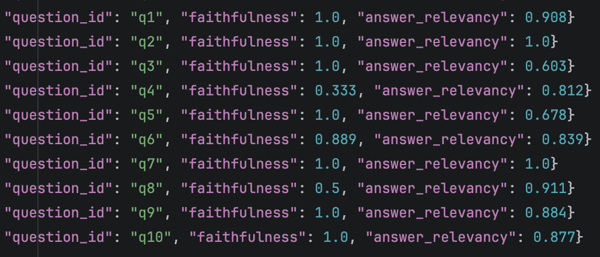

# Задание 7. Аналитика покрытия и качества базы знаний
>В финальном задании проектной работы вы должны оценить полноту и актуальность базы знаний, выявить темы, по которым бот не сможет дать ответы, и обоснованно улучшить покрытие. Это ключевой шаг, чтобы превратить RAG-бота из эксперимента в полноценный рабочий инструмент.
>RAG-система бесполезна, если:
>- она не знает ответов на частые вопросы,
>- база знаний неполная или устаревшая,
>- нельзя понять, по каким темам бот «слеп».
>В реальных продуктах эта проблема решается через аналитику логов запросов, автоматические тесты и покрытие «золотыми вопросами» (golden set).

## Что нужно сделать?
>1. Внесите искусственные пробелы в базу.
>   - Удалите 2-3 ключевые сущности из вашей базы знаний. Например, упоминания планеты VoidCore, персонажа Xarn Velgor и концепта Synth Flux. Так вы сможете протестировать, как ваш чат-бот себя ведёт при отсутствии нужной информации.
>2. Напишите скрипт логирования запросов. Каждый запрос к боту должен сохраняться в лог с полями:
>   - текст запроса,
>   - timestamp,
>   - были ли найдены чанки,
>   - длина ответа,
>   - флаг «успешный ответ» (по длине, осмысленности или по ключевым словам),
>   - найденные источники.
>   - Можно вести лог в CSV, JSONL или SQLite — любой формат, пригодный для анализа.
>3. Сформируйте «золотой набор» вопросов
>   - Подготовьте 10–15 вопросов, покрывающих разные аспекты вашей базы:
>     - 6–8 вопросов на известные темы (бот должен ответить),
>     - 3–5 вопросов на удалённые или отсутствующие (бот должен не ответить корректно). 
>4. Проведите автоматическое тестирование. Запустите скрипт, который:
>     - по очереди будет задавать вопросы из набора,
>     - результат в лог,
>     - оценит, был ли ответ корректным (например: ответ найден: да/нет + оценка полноты).
>5. Проанализируйте логи. Выявите:
>     - По каким темам бот часто не отвечает.
>     - Где выдаёт нерелевантные источники.
>     - Где нужно расширить или переписать базу знаний.
>6. Нарисуйте диаграмму. Постройте диаграмму последовательности (sequence diagram), которая покажет:
>   - Как обрабатывается запрос.
>   - Как происходит процесс оценки.
>   - Где может происходить сбой (например, пустой индекс, невалидный чанк, генерация ответа).
>
>Результат. По итогу задания у вас должно получиться:
>  - logs.jsonl или logs.csv с полями: запрос, результат, источники, длина, статус.
>  - golden_questions.txt с ожидаемыми ответами.
>  - Спроектированное автоматическое тестирование обновлённой версии индекса на наборе заранее подготовленных «золотых» вопросов. Их вам нужно самостоятельно придумать на основе вашей базы.
>  - Скрипт evaluate.py или test_rag_bot.py — автоматическая проверка качества.
>  - Диаграмма на PlantUML или с помощью онлайн-сервисов для создания диаграмм и схем Draw.io или mermaid.
>
>**Важно**! Пока, к сожалению, ещё не сложилось никаких лучших практик, на которые можно опереться, ведь сама тема всё ещё довольно новая. Однако вот несколько референсов, на которые стоит ориентироваться.
>- [Исследование по оценке RAG](https://arxiv.org/abs/2405.07437)
>- [Подробное руководство по передовому опыту оценки RAG](https://qdrant.tech/blog/rag-evaluation-guide)
>- [Как мы оцениваем точность ответов основанного на RAG AI-помощника](https://habr.com/ru/companies/alfastrah/articles/889042/)
>- [Как оценивать ваш RAG-пайплайн и валидировать качество ответов LLM](https://habr.com/ru/articles/870174/)
>- [Оцениваем RAG-пайплайны](https://habr.com/ru/articles/778166/)
>Референс отчёта с выводами должен содержать:
>- Какие темы плохо покрыты.
>- Сколько «пробелов» выявлено.
>- Рекомендации по улучшению базы знаний компании.


## ADR: общие решения
1. Прикладные цели сформулированы из моего понимания задания (оно местами абстрактное: «какие темы плохо покрыты», «рекомендации по улучшению»). В учебном проекте это означает:
   - научиться выявлять деградацию RAG и различать её типы;
   - построить пайплайн регулярного расчёта retrieval‑ и generation‑метрик;
   - предложить архитектурные изменения для сбора метрик;
   - подробно разобрать один сценарий деградации: удаление документов из KB;
   - понять, как по метрикам ловить другие проблемы:
     - пустой индекс;
     - падение релевантности чанков;
     - деградация генерации.
2. Так как на прошлых этапах уже есть три сервиса (`rag-api-safe`, `rag-kb-updater`, `tg-rag-sw-bot-safe`), для расчёта метрик добавлен новый сервис [task7/rag-monitor](rag-monitor). Ниже — решения по его реализации и изменениям в соседних сервисах.
3. Общий пайплайн сбора метрик:
   - a) формируются два голден датасета данных:
     - [task7/rag_kb_updater/golden_questions.jsonl](rag_kb_updater/_golden/golden_questions.jsonl) - список из 10 вопросов, которые `rag-kb-updater` будет использовать для массового поиска в индексе, после его изменения;
     - [task7/rag-monitor/retrieval_golden.jsonl](rag-monitor/_golden/retrieval_golden.jsonl) - те же 10 вопросов + список чанки по `expected_embedding_ids`;
   - b) `rag-kb-updater` при изменении индекса вызывает новую bulk‑ручку `rag-api-safe` по списку `golden_questions`; это делает именно `rag-kb-updater`, чтобы быстро получить сырые поисковые логи для каждого снапшота;
   - c) сырые поисковые логи пишутся в `{run_id}_raw_retrieval.jsonl` в [rag_kb_updater/_runs/retrieval_logs/](rag_kb_updater/_runs/retrieval_logs);
   - d) лог запусков `rag-kb-updater` [rag_kb_updater/_runs/runs.jsonl](rag_kb_updater/_runs/runs.jsonl) дополняется ссылкой на сырые логи (только при изменении индекса);
   - e) в `rag-monitor` работает шедулер с джобой: читает логи `rag-kb-updater`, считает retrieval‑метрики, собирает ответы LLM и через `ragas` вычисляет метрики генерации:
     - e1) читаются `rag-kb-updater/_runs/runs.jsonl` и собственный лог запусков, ищутся необработанные изменения индекса;
     - e2) за один запуск `MonitorJob` считает метрики для всех новых снапшотов индекса;
     - e3) читаются сырые логи и `retrieval_golden.jsonl`, формируется датасет bulk‑вопросов с контекстом для LLM;
     - e4) по сырым логам и `retrieval_golden.jsonl` считаются `hit@k`, `recall@k`, `mrr@k`;
     - e5) метрики (по каждому вопросу и агрегированные) сохраняются в [retrieval_metrics.jsonl](rag-monitor/_metrics/retrieval_metrics.jsonl) и [retrieval_metrics_per_question.jsonl](rag-monitor/_metrics/retrieval_metrics_per_question.jsonl);
     - e6) `rag-monitor` обращается к bulk‑ручке в `rag-safe-api`, где многопоточный клиент опрашивает LLM;
     - e7) ответы логируются в [rag-monitor/_runs/generation_logs/](rag-monitor/_runs/generation_logs);
     - e8) собирается датасет `вопросы + ответы + контексты` для `ragas`;
     - e9) [rag-monitor/eval/ragas_metrics_evaluator](rag-monitor/eval/ragas_metrics_evaluator.py) в несколько потоков опрашивает LLM‑судью (та же модель `gpt-4o-mini`) и считает `faithfulness` и `answer_relevancy`; дополнительно используется `text-embedding-3-small`;
     - e10) `ragas`‑метрики сохраняются в [ragas_metrics.jsonl](rag-monitor/_metrics/ragas_metrics.jsonl) и [ragas_metrics_per_question.jsonl](rag-monitor/_metrics/ragas_metrics_per_question.jsonl);
     - e11) итоговые результаты пишутся в [task7/rag-monitor/processed_runs.jsonl](rag-monitor/_runs/processed_runs.jsonl); по нему отмечаются обработанные запуски (шаг e1).
4. Правки в `rag-api-safe`:
   - bulk‑ручки (retrieval и generation) вынесены в [task7/rag-api-safe/api/routes_bulk.py](rag-api-safe/api/routes_bulk.py);
   - bulk‑ручки используют те же safe‑механизмы, что и основной клиент;
   - добавлен многопоточный OpenAI‑клиент [task7/rag-api-safe/ragbulk_openai_client.py](rag-api-safe/rag/bulk_openai_client.py).
5. Правки в `rag-kb-updater`:
   - новый клиент [task7/rag_kb_updater/rag_api_safe_client.py](rag_kb_updater/services/rag_api_safe_client.py);
   - `UpdaterJob` теперь при изменении индекса прогоняет golden set через `rag-api-safe`;
   - успешным обновлением считается изменение манифеста; оно фиксируется только если сбор поисковых логов прошёл корректно, иначе пересчёт переносится на следующий запуск.
6. Про `rag-monitor`.
   - ключевая идея: отдельный сервис выполняет все тяжёлые операции по метрикам асинхронно:
     - расчёт retrieval‑метрик по изменившимся контекстам;
     - опрос основной LLM золотым набором (вопрос + контекст) для актуальных ответов;
     - опрос LLM‑судьи через `ragas` (вопрос + ответ + контекст) для метрик генерации;
   - **примечания:**
     - в учебном проекте для `ragas` не используются ожидаемые ответы;
     - с ожидаемыми ответами можно получить дополнительные метрики;
     - но составление качественных «эталонов» — затратная работа, в проде это скорее must‑have.
   - сервис не тормозит обновление индекса, является «мастером» golden‑датасета и масштабируется отдельно;
   - ключевые компоненты:
     - [rag_api_client.py](rag-monitor/clients/rag_api_client.py);
     - расчёт retrieval‑метрик: [ragas_metrics_evaluator.py](rag-monitor/eval/ragas_metrics_evaluator.py);
     - расчёт ragas‑метрик: [ragas_metrics_evaluator.py](rag-monitor/eval/ragas_metrics_evaluator.py);
     - DTO: [metrics_model.py](rag-monitor/models/metrics_model.py), [retrieval_models.py](rag-monitor/models/retrieval_models.py), [run_models.py](rag-monitor/models/run_models.py);
     - хранение логов и метрик: [metrics_store.py](rag-monitor/storage/metrics_store.py), [raw_logs_reader.py](rag-monitor/storage/raw_logs_reader.py);
     - запись логов запусков: [run_summary_writer.py](rag-monitor/storage/run_summary_writer.py);
     - шедулер: [scheduler.py](rag-monitor/jobs/scheduler.py);
     - основной пайплайн: [monitor_job.py](rag-monitor/jobs/monitor_job.py).
7. Диаграммы последовательностей с типовыми сбоями RAG и их симптомами. Процессы разделены на три ветки:
   - обновление индекса 
   - путь от вопроса пользователя до ответа 
   - логи и метрики 

## Как запустить в docker или локально?
1. Достаточно пустого каталога [task7/chroma_db](chroma_db). Коллекция будет создана при первом старте обновлятора (если удалить [manifest.json](rag_kb_updater/_artifacts/manifest.json)). Если коллекция непустая, то тоже ок.
2. Получить `OpenAI_API` токен; по аналогии с [task7/rag-api-safe/.env.secrets.example](rag-api-safe/.env.secrets.example) создать файлики`.env.secrets` и добавить туда созданный токен `OpenAI_API` для:
   - `rag-api-safe`;
   - `rag-monitor`;
3. Создать своего ТГ бота, добавить в него команды:
    - `/change_mode {mode: zero_shot/few_shot/cot}` для смены режима промптинга;
    - `/toggle-safety {safe_prompt: true/false} {safe_prompt: true/false} {safe_prompt: true/false}` для смены режимов безопасности.
4. Добавить токен бота по аналогии с [../task5/tg-rag-sw-bot-safe/.env.secrets.example](../task5/tg-rag-sw-bot-safe/.env.secrets.example) в файлик `.env.secrets`.
5. Загрузить локально нужную `EMBEDDING_MODEL_NAME` [task7/rag-api-safe/.env](rag-api-safe/.env) заранее, чтобы она не скачивалась при каждом запуске контейнера `rag-api-safe`, например:
    ```shell
    pip install --quiet huggingface_hub
    huggingface-cli download BAAI/bge-m3
    ```
6. Старт всех 4 приложений `docker-compose` из [task7/](../task7) командой ` docker compose -f docker-compose.yml up --build -d`. `rag-api-safe` доступно на 8002 порту.
7. Далее менять состав `knowledge_base`, наблюдать как пересчитывается индекс и рассчитываются метрики.

    
## Методика проверки деградации RAG при удалении документов из KB
- считаем retrieval‑ и ragas‑метрики для разных снапшотов индекса;
- сравниваем 2 состояния KB: полная база (30 документов) и база с удалёнными 5 документами:
  - Киргиоз: [Граак.md](knowledge_base/characters/rebels/%D0%93%D1%80%D0%B0%D0%B0%D0%BA.md);
  - Френсис Тиафо: [Хан Соло.md](knowledge_base/characters/rebels/%D0%A5%D0%B0%D0%BD%20%D0%A1%D0%BE%D0%BB%D0%BE.md);
  - Есть данные про Френсиса Тиафо: [Чубакка.md](knowledge_base/characters/rebels/%D0%A7%D1%83%D0%B1%D0%B0%D0%BA%D0%BA%D0%B0.md);
  - Матч при Ролланд Гаррос: [Битва_при_Джакку.md](knowledge_base/events/%D0%91%D0%B8%D1%82%D0%B2%D0%B0_%D0%BF%D1%80%D0%B8_%D0%94%D0%B6%D0%B0%D0%BA%D0%BA%D1%83.md)
- во втором снапшоте ответы на 4/10 вопросов (q6–q10) должны пропасть, потому что они есть только в удалённых документах;
- считаем три retrieval‑метрики: `hit@k`, `recall@k`, `mrr@k` по golden‑датасету с ожидаемыми чанками (`embedding_ids`);
- для `ragas` используем `few_shot` (ниже — почему);
- рассчитываем две `ragas`‑метрики по LLM‑судье: `faithfulness` и `answer_relevancy`;
  - они не требуют эталонных ответов, поэтому считаем без них;
  - добавление эталонов — логичное развитие;
- считаем метрики и по каждому вопросу, и агрегированно.


## Анализ результатов
Для кейса с удалением документов из KB все метрики и исходники (логи, golden‑наборы) собраны в [task7/rag-monitor/_tests_results](rag-monitor/_tests_results).
- агрегированные метрики по двум циклам изменений: 25 доков → 30 доков → 25 доков → 30 доков;
  - retrieval‑метрики 
  - ragas‑метрики 
- метрики по вопросам при 30 и 25 документах (см. q4–q10):
  - retrieval 30 
  - retrieval 25 
  - ragas 30 
  - ragas 25 

### Оценка найден/не найден ответ
- Комбинация `hit@k` + `answer_relevancy` выглядит рабочей: два нуля почти гарантируют отсутствие ответа, значения близкие к 1 — наличие.
- Вопросы q6–q10 при сокращённой базе явно «проваливаются» по этим метрикам.

### Метрики retrieval
- все три retrieval‑метрики падают в ноль на вопросах без ответа после удаления документов;
- по `mrr@k` (< 1) видно, когда релевантные чанки не попадают в начало выдачи.

### Метрики ragas
- значения заметно ниже в `cot`, чем в `few_shot`. Пример — сложный вопрос «Подсчитай пилотов во всех цветных эскадрильях…»:
  - в `cot` LLM чаще находит только 3/5 эскадрилий (возможные причины: галлюцинации или «перегруженный» SAFE‑промпт);
  - в `few_shot` в 9/10 случаев находятся все 5;
  - однако в обоих режимах общее число пилотов «плавает», иногда ответ заявляется как «невозможен».
- поэтому `few_shot` выбран целевым для пайплайна метрик (генерация ответов для `ragas`) как более стабильный.
- практика показала: перед `ragas` лучше оставлять только финальный ответ, без цепочек рассуждений, заголовков и фрагментов чанков.
- `answer_relevancy`:
  - для вопросов без ответа падает в 0, потому что «нет данных» не отвечает на исходный вопрос;
  - на полном снапшоте колеблется (примерно 0.6–1.0);
  - разнится между поколениями из‑за `temperature=0.2`.
- `faithfulness` (соответствие контексту):
  - на простых вопросах близка к 1;
  - на сложных (например, «Сколько пилотов в цветных эскадрильях…») сильно плавает (0.33–0.89), т. к. ответы вариативны.

### Что говорят метрики в процессах RAG?
- при «здоровой» системе агрегированные метрики по golden‑набору должны быть стабильны;
- если падают групповые метрики, дальше смотрим per‑question для уточнения причины;
- в тестовом примере для восстановления ответов достаточно вернуть документы;
- в реальном продукте падение редко будет до нуля — нужен разбор:
  - проблема в KB — если просели и retrieval, и generation;
  - проблема в поиске/индексации — если падают только retrieval‑метрики;
  - проблема в генерации — если просели только ragas‑метрики;
  - возможна и ложная тревога — например, датасет устарел после изменений в KB.
- также возможна «невидимая» проблема при завышенных метриках; поэтому датасеты нужно внимательно готовить, регулярно перепроверять и собирать пользовательский фидбек.
